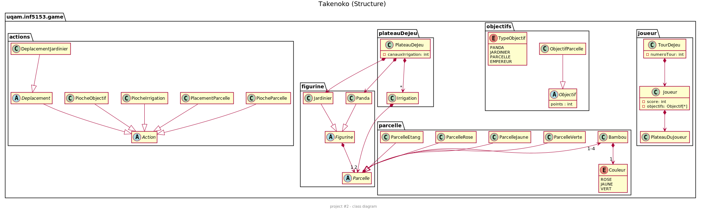
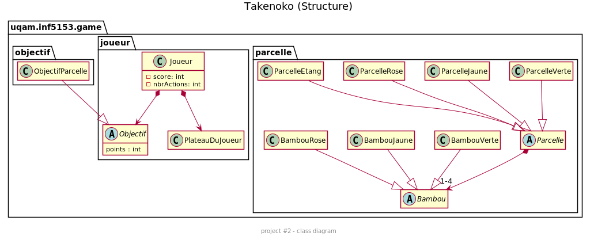

### Équipe J - première semaine

i _ Le travail effectué par les membres et heures passés :

1 -  Farahnaz kashandeh k. 
- Participer à la concéption avec mon équipe, 6 heures.
- créer et implémenter le class bambou et enum Couleur, 2 heures.

2 -  Kokou Eyram Joel Afetse
-  Participer à la concéption avec mon équipe, 6 heures.
-  Début de conception de l'implémentation des pioches en cours.

3 -  Mehdi Djohor
- Participer à la concéption avec mon équipe.

4 -  Yazid Iharkane
- Participer à la concéption avec mon équipe, 6 heures.
- Créer la classe PlateauDeJeu. Actuellement, elle permet de deposer les Parcelles sur le plateau, 
elle affiche les coordonnées des parcelles deposées et les positions possibles pour le prochain depot. 6h

ii. Les objectifs que le projet est censé remplir

- créer et implémenter les interface et les class parceles, et bambou.
- l’initialisation du plateau de jeu de chaque joueur

iii.Notre plan d'action pour la prochaine livraison
- Continuer l'implémentation du plateau de jeu.
- travailler sur les actions. 

iv.diagram de UML 

*********************************
### Équipe J - Deuxième semaine
*********************************
i _ Le travail effectué par les membres heures passés:

Tous les membres d'équies ont ensemple participé à la concéption  
pendants 3 heures et ils ont mis des plusieurs heures chaqu'un de son coté
pour implementer : 

1 -  Yazid Iharkane
- Continuer ajouter des fonctionalités à la calasse PlateauDeJeu
- Implementer le class ReseauIrrigation, ...

2 -  Kokou Eyram Joel Afetse
- Investiguer sur la fonctionnalité de placer les irrigations.
- fonctionnalité de pioche implémentée.

3 -  Farahnaz kashandeh k. 
- Implementer la classe Irrigation, pioche de l'irrigation.
- corriger la classe bambou ...

ii. Les objectifs que le projet est censé remplir 

- Continuer l'implémentation du plateau de jeu.
- initialisation les objectifs et le pioche d'objectifs, l'irrigation 
- traviller sur les actions, piocher 3 parcelles, piocher irrigation. 

iii.Notre plan d'action pour la prochaine livraison

- Continuer travailler sur les actions, deplacer le jardinier,
- travailler sur la prtie des décision.

iv.diagram de UML 

*********************************
### Équipe J - Troisième semaine
*********************************

1-Yazid Iharkane

- Implementer la classe ObejctifParcelle.
- Faire les modifications necessaires dans les autres classes (Parcelle, PalteauDeJeu, etc.) 
   pour les adapter à la classe ObjectifParcelles.
   

